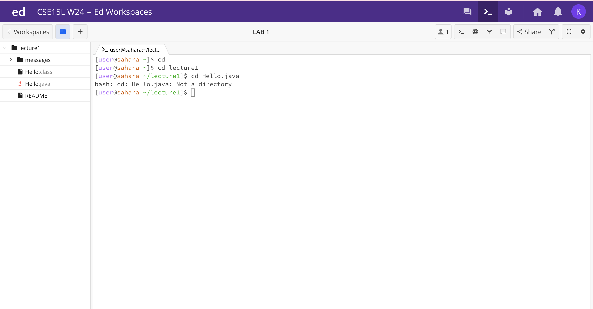
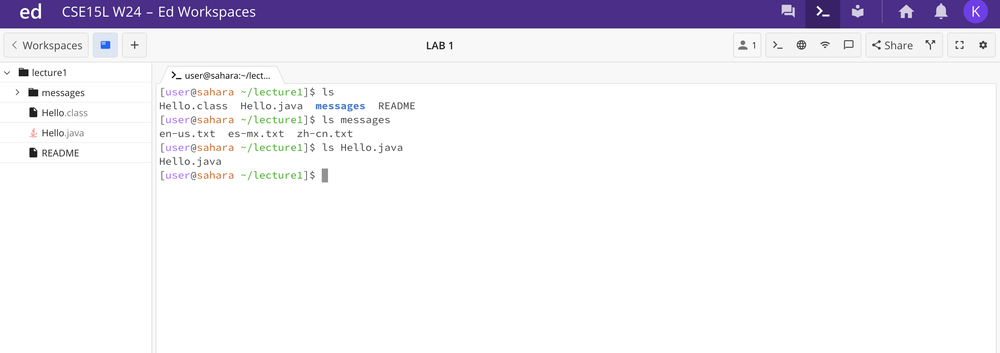
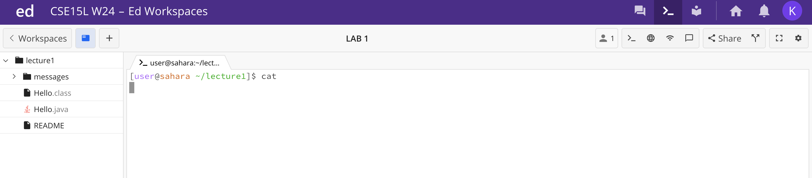

Lab Report 1
`cd

The first line, with home directory working, shows cd as the command line with no arguments and this command didn't produce any output or made any changes in the foldersd nor files. Having now arguments caused teh command to produce no output as it did not have any argument to pass on.
ls

cat

