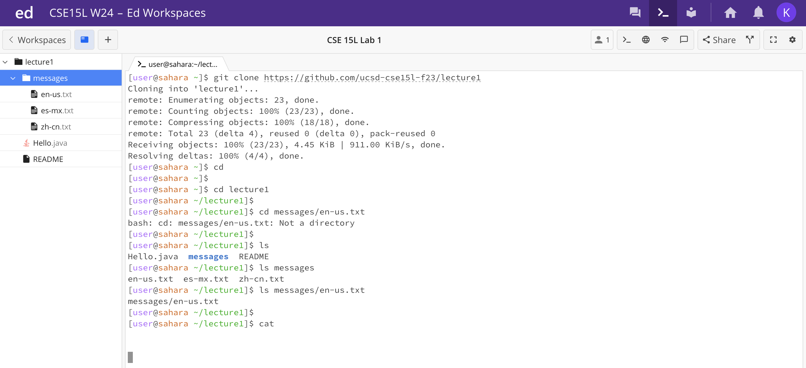
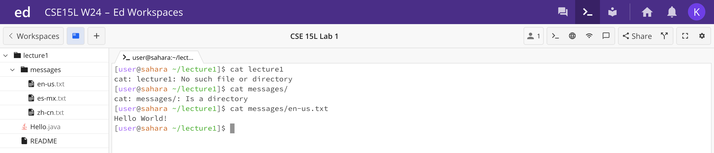

# Lab Report 1






## `cd` command


#### `cd` with no argument
```
[user@sahara ~]$ cd
[user@sahara ~]$ 
```
- The working directory when the command was run was the home directory.
- running the command `cd` with no argument had no change nor presented a visible output. This is because `cd` is meant is meant to change the working directory but with no argument it did not have a directory to change the prompt in the terminal into.
- the output was not an error as the command ran and had no error message.


---


#### `cd` with path to a directory
```
[user@sahara ~]$ cd lecture1
[user@sahara ~/lecture1]$ 
```
- The working directory when the command was run was the home directory.
- running the command `cd` with path to a directory cause the running directory to be changed into lecture1. Like I mentioned, `cd` is meant is meant to change the working directory and with a path to a directory, lecture1, it provided an output of having a different running directory for future commands.
- the output was not an error as the command ran and produced an output.
  
---
#### `cd` with path to a file
```
[user@sahara ~/lecture1]$ cd messages/en-us.txt
bash: cd: messages/en-us.txt: Not a directory
[user@sahara ~/lecture1]$ 
```
- The working directory when the command was run was the lecture1 directory.
- running the command `cd` with path to a file printed a message saying "bash: cd: messages/en-us.txt: Not a directory". Again, `cd` is meant is meant to change the working directory and since it was directed with a path to a file, it cannot switch the running directory to a file. 
- the output was an error as the command ran and produced an error message as the path was not to a directory instead was to a file to which the command cannot switch the directory into.


---
## `ls` command 


#### `ls` with no argument
```
[user@sahara ~/lecture1]$ ls
Hello.java messages README
[user@sahara ~/lecture1]$
```
- The working directory when the command was run was the lecture1 directory.
- running the command `ls` with no argument listed the files and folders within the directory. This is because ls is command meant to show the names of files and folders within the running directory and so this command printed a list of files and folders within the lecture1 directory.
- the output was not an error as it produced its expected output of the list of the names of files and folders.
  
---
#### `ls` with path to a directory
```
[user@sahara ~/lecture1]$ ls messages
en-us.txt es-mx.txt zh-cn.txt
[user@sahara ~/lecture1]$
```
- The working directory when the command was run was the lecture1 directory.
- running the command `ls` with a path to a directory also listed the files and folders within the said directory. Again, ls is command meant to show the names of files and folders within the running directory and so this the command `ls` messages printed a list of files and folders within the messages directory.
- the output was not an error as it produced its expected output of the list of the names of files and folders.
  
___
#### `ls` with path to a file
```
[user@sahara ~/lecture1]$ ls messages/en-us.txt
messages/en-us.txt
[user@sahara ~/lecture1]$
```
- The working directory when the command was run was the lecture1 directory.
- running the command `ls` with a path to a path produced an output of the command line. This is because it was a path to a file to which did not contain any files nor folders and therefore gave that certain output. 
- the output was not an error as it produced an output but not an error message.
  
---
## `cat` command

#### `cat` with no argument
```
[user@sahara ~/lecture1]$ cat

cat
cat
```
- The working directory when the command was run was the lecture1 directory.
- running the command `cat` with no argument caused the prompt to disappear as the `cat` command had no argument to read and so it was caused to rely on the terminal, and anything to be written on the terminal will be what the `cat` will read and produced as an output. 
- the output was not an error as it had no error message and was still working despite the prompt in the terminal missing. 
  
___
#### `cat` with path to a directory
```
[user@sahara ~/lecture1]$ cat lecture1
cat: lecture1: No such file or directory


[user@sahara ~/lecture1]$ cat messages
cat: messages: Is a directory
[user@sahara ~/lecture1]$
```
- The working directory when the command was run was the lecture1 directory.
- the first `cat` command was a path to a already running directory, and therefore the output say "No such file or directory" and the directory did not contain any files or folders with the same name.
- the second command was to a directory within the running directory but still gave a message saying the "is a directory" this is because the command was mean to read files and print its contents.
- the output/s are errors as produced error messages saying the passed on arguments are not present or it was of different type, such that it was a directory.
  
---
#### `cat` with path to a file
```
[user@sahara ~/lecture1]$ cat messages/en-us.txt
Hello World!
[user@sahara ~/lecture1]$
```
- The working directory when the command was run was the lecture1 directory.
- running the `cat` command with a path to a file was a success. It printed "Hello World!" since `cat` command was meant to read and print the prompted file contents. 
- the output was not an error as it produced its expected output of reading and printing a file content. 
  
