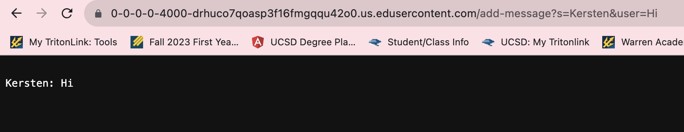
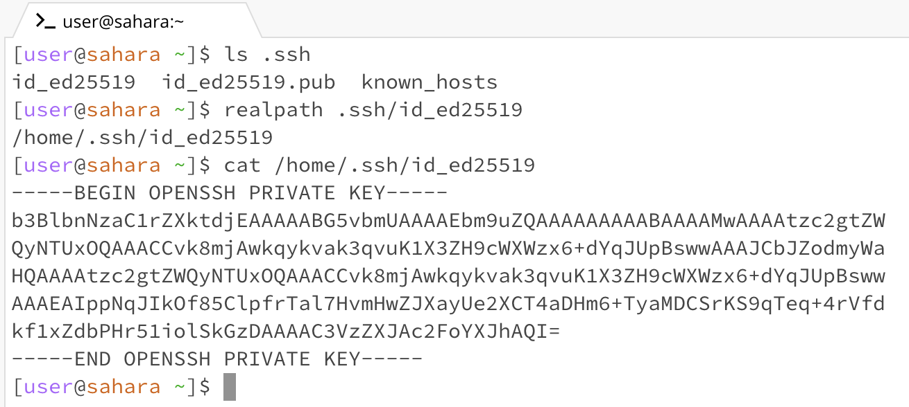
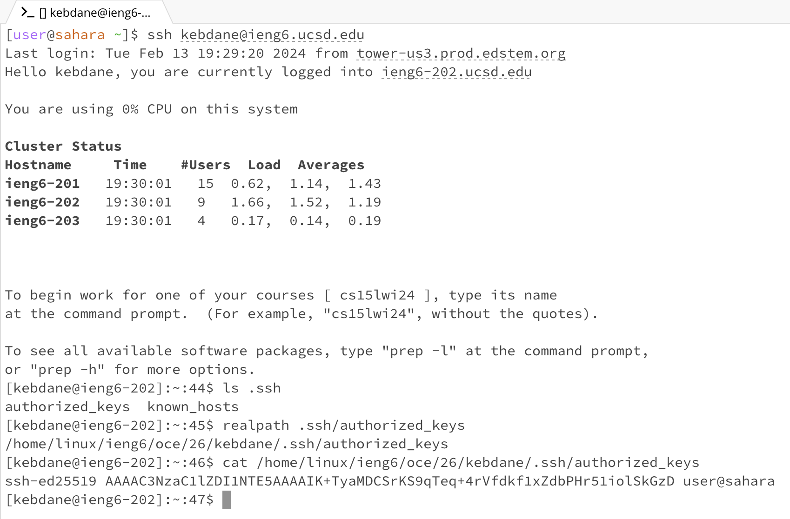
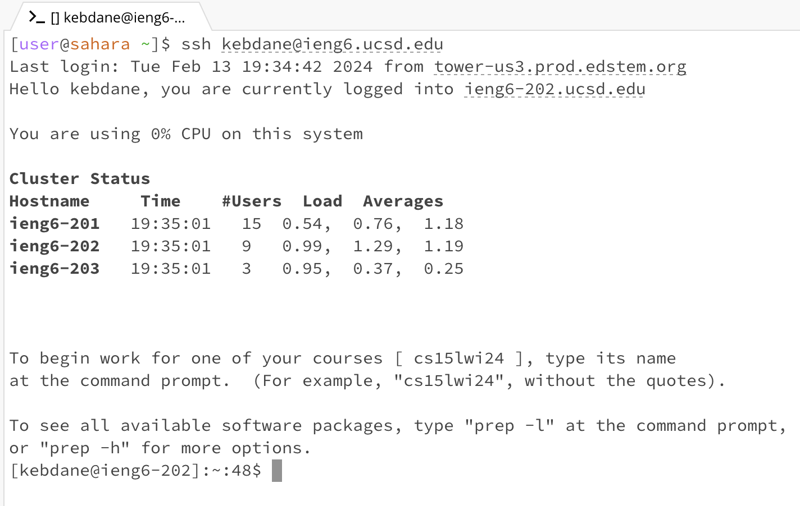

# Lab Report 2

## Part 1

ChatServer.java code
```
import java.io.IOException;
import java.net.URI;
import java.util.ArrayList;

class Handler implements URLHandler {
    ArrayList<String> messages = new ArrayList<>();

    public String handleRequest(URI url) {
        if (url.getPath().contains("/add-message")) {
            String[] parameters = url.getQuery().split("&");
            
            String[] fStrings = (parameters[0].split("="));
            String[] sStrings = (parameters[1].split("="));

            messages.add(fStrings[1] + ": " + sStrings[1]);
        }  
        String allMessages = "";
            for(int i = 0; i < messages.size(); i++){
                allMessages += ("\n" + messages.get(i));
            }
        if(messages.size() > 0){
            return allMessages;
        }else{
            return "404 Not Found!";
        }
    }
}       

class ChatServer {
    public static void main(String[] args) throws IOException {
        if(args.length == 0){
            System.out.println("Missing port number! Try any number between 1024 to 49151");
            return;
        }

        int port = Integer.parseInt(args[0]);

        Server.start(port, new Handler());
    }
}
```

* `handleRequest()` method was called
* The relevant argument to this method was the `URI url`, for example`0-0-0-0-4000-drhuco7qoasp3f16fmgqqu42oO.us.edusercontent.com/add-message?s=Kersten&user=Hi`. To which contains the a path request `/add-message`.
* The values of this request such as `s=Kersten&user=Hi` gets split up into two String values. Such that the `.split` method's condition is the String to be split up with the character of `&`. The resulting strings, in this case `s=Kersten` and `user=Hi` will then be split up again but this time with the character `=`.


* `handleRequest()` method was called
* The relevant argument to this method was the `URI url`, in this case, `0-0-0-0-4000-drhuco7qoasp3f16fmgqqu42oO.us.edusercontent.com/add-message?s=Kersten&user=Hello`. To which contains the a path request `/add-message`.
* The values of this request such as `s=Kersten&user=Hello` gets split up into two String values. Such that the `.split` method's condition is the String to be split up with the character of `&`. The resulting strings, in this case `s=Kersten` and `user=Hi` will then be split up again but this time with the character `=`.

## Part 2




* Here having a private key, made logging into ieng6 account much easier by not requiring to enter your password every time.

## Part 3
* During Lab 2 and 3, I learned a lot. Most of the activities were pretty much new to me such as building and running a server. I didn't know how to create a server before and so having a starter code that we could edit and observe its outputs was very helpful for me. I also learned few new commands such as `curl`, `mkdir`, and `scp`. I wasn't aware of these commands before and I think learning these commands will be very helpful with future activities of this class and other classes I'm taking/ will take. 

