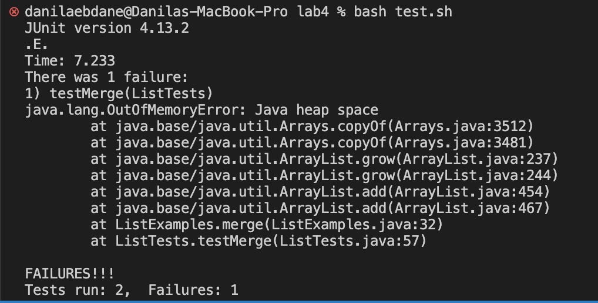

# Lab Report 5 - Putting It All Together
### Part 1 - EdStem post
* Student Post:
  
  Hi! So I'm working on my ListExamples file and can't seem to make it work. I keep testing and keep getting this error

  Based on this, I see that there is abug with my merge method, although I am not sure what does it mean having error with java heap space. It also says OutOfMemoryError, and I am not sure how to fix this.
  
* TA Response:

  From what I am seeing here, your code is using large amount of memory. Try looking over your code where it creates a new object that may hold large datasets such as lists. Base on this, your merge method may be adding too many elements to it. 

* Student Response

  I tried your suggestion and as I was using a while method to add elements in a new list, I found out I am indexing it wrong thus causing an inifnite loop where the method keeps adding elements to the new list infinitely causing the out of memory error. Now the test cases seem to run fine!

### Part 2 - Reflection
  On the second half of the quarter so many things, but one thing that was interesting and new to me was the Vim editor. It was cool for me because I learned that we can edit our files with just using the terminal, although saving and commiting it takes more steps. I also like how we were able to build our own grading script to which allow us to know how some programs like gradescope works. Everything were pretty much new to me and was really helpful to be learned. 
