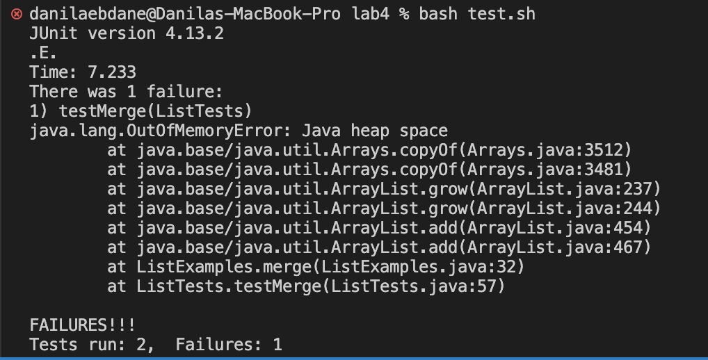

# Lab Report 5 - Putting It All Together
### Part 1 - EdStem post
Student Post:
  Hi! So I'm working on my ListExamples file and can't seem to make my merge method work. I keep testing the method and keeps getting this error

### Part 2 - Reflection
  On the second half of the quarter so many things, but one thing that was interesting and new to me was the Vim editor. It was cool for me because I learned that we can edit our files with just using the terminal, although saving and commiting it takes more steps. I also like how we were able to build our own grading script to which allow us to know how some programs like gradescope works. Everything were pretty much new to me and was really helpful to be learned. 
